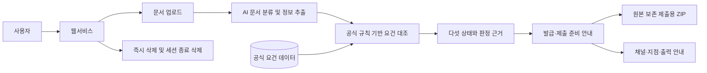

<div align="center">

<br>

# 🗂️ ProofBridge (가제)

### 흩어진 증빙과 금융 업무 사이를 연결합니다

**모르면 그냥 다 넣으세요. 필요한 것만 챙겨드릴게요.**

<br>

[](https://daker.ai/public/hackathons/2026-finance-ai-challenge)
[](https://www.notion.so/3baf95a7decf80c98d38c63c8e80b66e)

<br>

</div>

---

## 서류는 이미 있는데, 무엇을 내야 할지 모를 때

ProofBridge는 가지고 있는 문서를 한꺼번에 올리면 목적·기관별 공식 요건과 대조해 **쓸 수 있는 서류와 부족한 서류를 구분하고, 발급부터 방문·출력까지 다음 행동을 안내하는 AI 증빙 준비 웹서비스**입니다.

| 🗂️ 한 번에 모으고 | 🔎 근거로 확인하고 | 🌉 제출 직전까지 연결합니다 |
| :--: | :--: | :--: |
| 서류명을 몰라도 PDF·사진을 한꺼번에 업로드 | 공식 요건으로 누락·만료·불일치를 판정 | 발급 경로·제출 순서·방문·출력을 안내 |

<p align="center">
  <b>업무 선택</b>　→　<b>전체 파일 업로드</b>　→　<b>자동 분류·검증</b>　→　<b>제출 묶음 완성</b>
</p>

### 결과는 다섯 가지로 단순하게

`준비 완료`　·　`추가 필요`　·　`기한 만료`　·　`정보 불일치`　·　`이번 업무에는 불필요`

> 첫 MVP는 **금융거래 목적 증빙 및 한도제한계좌 해제 준비**를 끝까지 완주하는 데 집중합니다.

<br>

<div align="center">

## Team ProofBridge

<table>
  <tr>
    <td align="center" width="200">
      <a href="https://github.com/bbcc1017">
        <br>
        <b>류연우</b>
      </a><br>
      <sub><a href="https://github.com/bbcc1017">@bbcc1017</a></sub><br>
      <sub><a href="mailto:bbcc1017@inha.edu">bbcc1017@inha.edu</a></sub>
    </td>
    <td align="center" width="200">
      <a href="https://github.com/oymin2001">
        <br>
        <b>오영민</b>
      </a><br>
      <sub><a href="https://github.com/oymin2001">@oymin2001</a></sub><br>
      <sub><a href="mailto:oymin2001@inha.ac.kr">oymin2001@inha.ac.kr</a></sub>
    </td>
    <td align="center" width="200">
      <a href="https://github.com/chanbro0524">
        <br>
        <b>이찬형</b>
      </a><br>
      <sub><a href="https://github.com/chanbro0524">@chanbro0524</a></sub><br>
      <sub><a href="mailto:dlcksgud208@naver.com">dlcksgud208@naver.com</a></sub>
    </td>
    <td align="center" width="200">
      <a href="https://github.com/grrlkk">
        <br>
        <b>장찬우</b>
      </a><br>
      <sub><a href="https://github.com/grrlkk">@grrlkk</a></sub><br>
      <sub><a href="mailto:grrlkk@inha.edu">grrlkk@inha.edu</a></sub>
    </td>
  </tr>
</table>

</div>

<br>

---

<details>
<summary><b>🎯 MVP 범위와 판정 원칙</b></summary>

### 지원 범위

- **대상 금융기관**: KB국민은행, 우리은행, 카카오뱅크
- **대표 거래 목적**: 급여 수령, 생활비·공과금, 사업, 해외 사용
- **입력**: 여러 PDF·JPG·PNG 파일의 일괄 업로드
- **처리**: 문서 종류·발급기관·명의·발급일·유효기간·핵심 필드 인식
- **결과**: 판정 근거, 부족 서류 발급 안내, 원본 보존 제출용 ZIP, 방문·출력 안내

### 다섯 가지 판정 상태

| 상태 | 의미 |
| :--: | :-- |
| 준비 완료 | 공개된 공식 기준에서 사용할 수 있는 것으로 확인된 서류 |
| 추가 필요 | 필수 또는 현재 조건에서 필요한 서류가 없는 상태 |
| 기한 만료 | 발급일 또는 유효기간 조건을 충족하지 못한 상태 |
| 정보 불일치 | 이름·주소·사업자번호·기간 등 확인 필드가 서로 다른 상태 |
| 이번 업무에는 불필요 | 인식은 됐지만 선택한 업무의 제출 묶음에서는 제외할 서류 |

문서 분류와 쉬운 설명에는 AI를 활용하지만, 최종 준비 상태는 **공식 출처를 구조화한 규칙**으로 판정합니다. 근거가 부족하면 준비 완료로 추측하지 않고 `확인 필요`로 남깁니다.

</details>

<details>
<summary><b>🧭 시스템 아키텍처</b></summary>

아래 구조는 기능 중심의 초기 설계이며, 구현 기술은 MVP 개발 과정에서 확정합니다.



</details>

<details>
<summary><b>🛠️ 기술 스택 후보</b></summary>

<br>

[](https://www.python.org/)
[](https://streamlit.io/)
[](https://fastapi.tiangolo.com/)
[](https://developer.mozilla.org/docs/Web/HTML)
[](https://developer.mozilla.org/docs/Web/CSS)
[](https://developer.mozilla.org/docs/Web/JavaScript)
[](https://git-scm.com/)

웹 UI는 빠른 MVP에 적합한 Streamlit과 HTML 기반 프론트엔드 중에서 확정할 예정입니다. 후보 배지는 현재 설치된 의존성을 의미하지 않습니다.

</details>

<details>
<summary><b>🚀 시작하기</b></summary>

```bash
git clone https://github.com/bbcc1017/finance2026.git
cd finance2026
```

프로젝트 구조와 기술 스택이 확정되면 의존성 설치, 환경 변수와 실행 명령을 추가합니다.

</details>

<details>
<summary><b>🗓️ 개발 로드맵</b></summary>

- [x] 서비스 문제 정의 및 MVP 범위 설정
- [ ] 금융기관별 공식 제출 요건 조사
- [ ] 문서 분류·정보 추출 방식 검증
- [ ] 제출 요건 판정 규칙 구현
- [ ] 웹 UI 기술 스택 확정 및 프로토타입 구현
- [ ] 원본 보존 제출용 ZIP과 FIN MAP 안내 구현
- [ ] 개인정보 삭제·마스킹 및 접근성 검증
- [ ] 사용자 테스트와 문서화

</details>

<details>
<summary><b>🔒 개인정보 보호와 서비스 한계</b></summary>

- 원본 문서는 변경하지 않으며 사용자가 분석 결과와 함께 즉시 삭제할 수 있도록 합니다.
- 세션 종료 후 원본과 파생 데이터를 삭제하고, 로그에 민감한 원문을 남기지 않습니다.
- 민감 문서를 제3자 인쇄소로 자동 전송하지 않습니다.
- ProofBridge는 금융기관의 심사나 승인 여부를 보장하지 않습니다.
- 결과는 `승인 가능`이 아니라 **공개 기준 사전 점검 결과**로 안내합니다.

</details>

<br>

<div align="center">

<sub>ProofBridge · 2026 금융 AI Challenge</sub>

</div>
