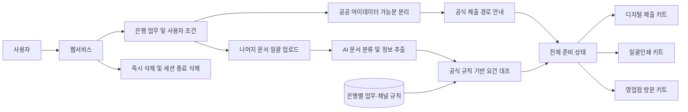

<div align="center">

<br>

# 🗂️ ProofBridge

### 흩어진 증빙과 금융 업무 사이를 연결합니다

**모르면 그냥 다 넣으세요. 필요한 것만 챙겨드릴게요.**

<br>

[](https://daker.ai/public/hackathons/2026-finance-ai-challenge)
[](https://www.notion.so/3baf95a7decf80c98d38c63c8e80b66e)

<br>

[공개 데모](https://proofbridge-finance-2026.ryuky0896.chatgpt.site) · [프로젝트 제안서 PDF](output/pdf/proofbridge-project-proposal.pdf) · [차별화 조사](docs/DIFFERENTIATION.md) · [API 가입 체크리스트](docs/API_ONBOARDING.md)

> 현재 데모는 링크를 아는 누구나 접속할 수 있습니다. 실제 개인정보 문서는 업로드하지 말고 합성 샘플만 사용해 주세요.

</div>

---

## 서류는 이미 있는데, 무엇을 내야 할지 모를 때

ProofBridge는 먼저 **공공 마이데이터로 제출할 수 있는 증빙은 공식 경로로 안내**하고, 그 밖의 사문서·사진·원본은 한꺼번에 올려 목적·은행별 요건과 대조한 뒤 **디지털 제출·일괄인쇄·영업점 방문에 맞는 준비 완료 키트**로 만드는 AI 금융업무 준비 웹서비스입니다.

| 🏛️ 보낼 것은 보내고 | 🗂️ 나머지만 채우고 | ✅ 준비 완료로 만듭니다 |
| :--: | :--: | :--: |
| 공공 마이데이터 대상은 공식 제출 경로로 안내 | 사문서·사진을 분석해 누락·만료·불일치를 판정 | 디지털·인쇄·방문 채널에 맞는 실행 키트 생성 |

<p align="center">
  <b>업무 선택</b>　→　<b>마이데이터 가능분 분리</b>　→　<b>나머지 문서 검증</b>　→　<b>준비 완료</b>
</p>

### 결과는 다섯 가지로 단순하게

`준비 완료`　·　`추가 필요`　·　`기한 만료`　·　`정보 불일치`　·　`이번 업무에는 불필요`

> 첫 MVP는 **금융거래 목적 증빙 및 한도제한계좌 해제 준비**를 끝까지 완주하는 데 집중합니다.

### 현재 만들어진 데모

- 로그인 없이 `카카오뱅크 · 생활비/공과금` 합성 시나리오를 클릭해 완주
- 공공 경로·직접 준비 문서·현장 지참물 분리
- `준비 완료`·`추가 필요`·`정보 불일치`·`이번 업무에는 불필요` 예시와 공식 근거 표시
- 공공·디지털·인쇄·방문 키트 미리보기, 큰 글자 전환, 제안서 PDF 열기

현재 버전은 **합성 데이터 기반 프론트엔드 청사진**입니다. 실제 파일 업로드, OCR·LLM, 규칙 엔진, ZIP, 즉시 삭제, 지도 API는 아직 연결하지 않았으며 화면에서도 구현 예정으로 구분합니다.

<br>

<div align="center">

## Team ProofBridge

<table>
  <tr>
    <td align="center" width="200">
      <a href="https://github.com/bbcc1017">
        <br>
        <b>류연우</b>
      </a><br>
      <sub><a href="https://github.com/bbcc1017">@bbcc1017</a></sub><br>
      <sub><a href="mailto:bbcc1017@inha.edu">bbcc1017@inha.edu</a></sub>
    </td>
    <td align="center" width="200">
      <a href="https://github.com/oymin2001">
        <br>
        <b>오영민</b>
      </a><br>
      <sub><a href="https://github.com/oymin2001">@oymin2001</a></sub><br>
      <sub><a href="mailto:oymin2001@inha.ac.kr">oymin2001@inha.ac.kr</a></sub>
    </td>
    <td align="center" width="200">
      <a href="https://github.com/chanbro0524">
        <br>
        <b>이찬형</b>
      </a><br>
      <sub><a href="https://github.com/chanbro0524">@chanbro0524</a></sub><br>
      <sub><a href="mailto:dlcksgud208@naver.com">dlcksgud208@naver.com</a></sub>
    </td>
    <td align="center" width="200">
      <a href="https://github.com/grrlkk">
        <br>
        <b>장찬우</b>
      </a><br>
      <sub><a href="https://github.com/grrlkk">@grrlkk</a></sub><br>
      <sub><a href="mailto:grrlkk@inha.edu">grrlkk@inha.edu</a></sub>
    </td>
  </tr>
</table>

</div>

<br>

---

<details>
<summary><b>🎯 목표 MVP 범위와 판정 원칙</b></summary>

### 지원 범위

- **대상 금융기관**: KB국민은행, 우리은행, 카카오뱅크
- **대표 거래 목적**: 급여 수령, 생활비·공과금, 사업, 해외 사용
- **공공 증빙**: 공공 마이데이터·전자증명서로 처리 가능한 자료와 공식 경로 안내
- **입력**: 여러 PDF·JPG·PNG 파일의 일괄 업로드
- **처리**: 문서 종류·발급기관·명의·발급일·유효기간·핵심 필드 인식
- **결과**: 판정 근거, 부족 서류 발급 안내, 디지털 제출용 ZIP, 일괄인쇄 순서, 영업점 방문 체크리스트

### 다섯 가지 판정 상태

| 상태 | 의미 |
| :--: | :-- |
| 준비 완료 | 공개된 공식 기준에서 사용할 수 있는 것으로 확인된 서류 |
| 추가 필요 | 필수 또는 현재 조건에서 필요한 서류가 없는 상태 |
| 기한 만료 | 발급일 또는 유효기간 조건을 충족하지 못한 상태 |
| 정보 불일치 | 이름·주소·사업자번호·기간 등 확인 필드가 서로 다른 상태 |
| 이번 업무에는 불필요 | 인식은 됐지만 선택한 업무의 제출 묶음에서는 제외할 서류 |

문서 분류와 쉬운 설명에는 AI를 활용하지만, 최종 준비 상태는 **공식 출처를 구조화한 규칙**으로 판정합니다. 근거가 부족하면 준비 완료로 추측하지 않고 `확인 필요`로 남깁니다.

</details>

<details>
<summary><b>🧭 시스템 아키텍처</b></summary>

아래 구조는 기능 중심의 초기 설계이며, 구현 기술은 MVP 개발 과정에서 확정합니다.



</details>

<details>
<summary><b>🛠️ 현재 기술 스택</b></summary>

<br>

- React 19 + TypeScript
- vinext + Vite
- CSS 기반 반응형·접근성 UI
- Cloudflare Workers 호환 Sites 배포 구조

백엔드·OCR·LLM은 아직 도입하지 않았습니다. 합성 정답표와 공식 규칙 구조가 준비된 뒤 필요한 공급자 하나씩만 연결합니다.

</details>

<details>
<summary><b>🚀 시작하기</b></summary>

```bash
git clone https://github.com/bbcc1017/finance2026.git
cd finance2026
cd apps/web
npm install
npm run dev
```

Node.js `>=22.13.0`이 필요합니다. `http://localhost:3000`에서 확인하고, 전체 빌드·렌더 검증은 `npm test`로 실행합니다. 현재 합성 데모에는 환경변수가 필요하지 않습니다.

</details>

<details>
<summary><b>📁 저장소 구조</b></summary>

```text
finance2026/
├─ apps/web/                 # 현재 클릭 데모
│  ├─ app/                   # 화면·스타일·메타데이터
│  ├─ public/                # 제안서 PDF·소셜 이미지
│  ├─ tests/                 # 서버 렌더 안전 경계 검사
│  └─ worker/                # Sites/Cloudflare 진입점
├─ docs/                     # 차별화 조사·API 가입 가이드
├─ output/pdf/               # 검수 완료 제안서
└─ scripts/                  # 제안서 재생성 스크립트
```

실제 API·규칙·합성 샘플 코드는 구현 시점에 필요한 디렉터리만 추가합니다.

</details>

<details>
<summary><b>🗓️ 개발 로드맵</b></summary>

- [x] 서비스 문제 정의 및 MVP 범위 설정
- [x] 공개 서비스 차별화 조사와 공공 마이데이터 역할 구분
- [x] 클릭 가능한 프론트엔드 청사진과 제안서 PDF
- [ ] 금융기관별 최신 공식 제출 요건 확정
- [ ] 문서 분류·정보 추출 방식 검증
- [ ] 제출 요건 판정 규칙 구현
- [ ] 원본 보존 제출용 ZIP과 FIN MAP 안내 구현
- [ ] 개인정보 삭제·마스킹 및 접근성 검증
- [ ] 사용자 테스트와 문서화

</details>

<details>
<summary><b>🔒 개인정보 보호와 서비스 한계</b></summary>

- 원본 문서는 변경하지 않으며 사용자가 분석 결과와 함께 즉시 삭제할 수 있도록 합니다.
- 세션 종료 후 원본과 파생 데이터를 삭제하고, 로그에 민감한 원문을 남기지 않습니다.
- 민감 문서를 제3자 인쇄소로 자동 전송하지 않습니다.
- ProofBridge는 금융기관의 심사나 승인 여부를 보장하지 않습니다.
- 공공 마이데이터 이용기관 승인을 받기 전에는 실제 연동·전송이 아니라 공식 이용 경로를 안내합니다.
- 결과는 `승인 가능`이 아니라 **공개 기준 사전 점검 결과**로 안내합니다.

</details>

<br>

<div align="center">

<sub>ProofBridge · 2026 금융 AI Challenge</sub>

</div>
