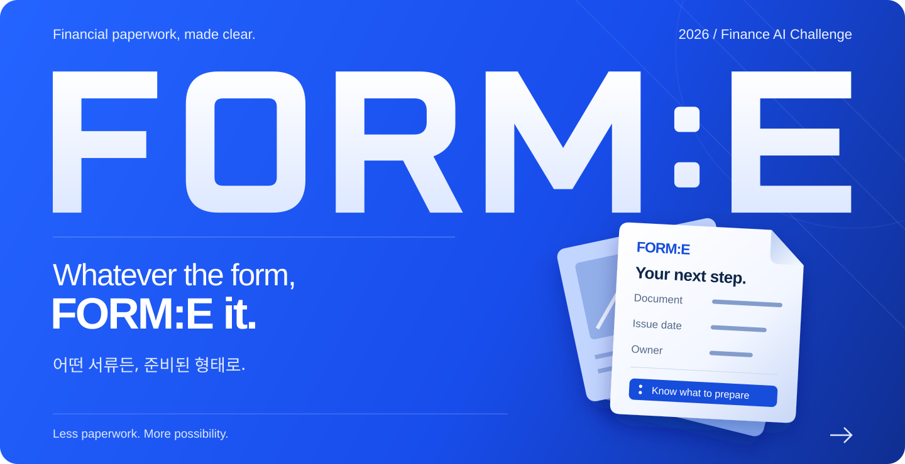
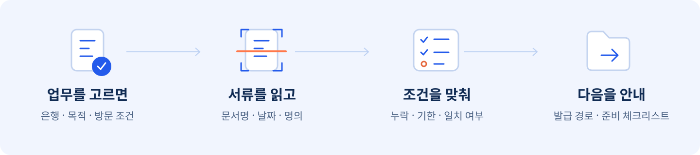

<a id="top"></a>

<div align="center">



<br><br>

### Whatever the form, FORM:E it.

**어떤 서류든, 준비된 형태로.**

서류 이름을 몰라도, 다음에 할 일은 알 수 있게.<br>
**FORM:E**는 흩어진 PDF와 사진을 읽고, 은행·업무별 요건에 맞춰<br>
**무엇이 있고, 무엇이 부족하고, 어떻게 준비하면 되는지** 알려주는 AI 금융업무 준비 서비스입니다.

<br>

[](https://proofbridge-2026.vercel.app)
[](https://www.notion.so/3baf95a7decf80c98d38c63c8e80b66e)
[](https://daker.ai/public/hackathons/2026-finance-ai-challenge)

<br>

[서비스 흐름](#experience) &nbsp; / &nbsp; [팀 소개](#team) &nbsp; / &nbsp; [기술과 구조](#engineering) &nbsp; / &nbsp; [로컬 실행](#quick-start)

</div>

<br>

<a id="experience"></a>

## 서류를 넣으면, 다음이 보입니다.

“이게 무슨 서류지?”, “다시 발급해야 하나?”, “뭘 더 챙겨야 하지?”<br>
FORM:E는 이런 질문을 **내 업무에 맞는 준비 안내**로 바꿉니다.



<table>
  <tr>
    <td width="33%" valign="top">
      <h3>서류의 이름부터.</h3>
      <p>제목과 내용을 읽고, 문서 종류·발급일·명의를 정리합니다.</p>
      <sub>PDF text first · OCR when needed</sub>
    </td>
    <td width="34%" valign="top">
      <h3>내 업무의 기준으로.</h3>
      <p>선택한 은행·업무·채널의 정책으로 필요한 조건을 대조합니다.</p>
      <sub>Bank · Purpose · Channel</sub>
    </td>
    <td width="33%" valign="top">
      <h3>다음 행동까지.</h3>
      <p>부족한 서류의 발급 경로와 방문 체크리스트를 안내합니다.</p>
      <sub>Official routes · Preparation kit</sub>
    </td>
  </tr>
</table>

<br>

<div align="center">

**보낼 수 있는 공공 증빙은 공식 경로로. 나머지 준비는 FORM:E로.**

공공 마이데이터·전자증명서로 처리할 수 있는 자료는 공식 이용 경로를 안내하고,<br>
직접 준비할 문서와 현장에서 챙길 준비물을 함께 살핍니다.

<br>


<sub>판정 근거가 부족하면 <b>확인 필요</b>로 남깁니다. 준비 상태는 금융기관의 승인을 뜻하지 않습니다.</sub>

</div>

<br>

<a id="team"></a>

## Built by us. Ready for you.

문서를 읽는 기술부터, 데이터를 모으고 결과를 검증하는 일까지. **Team FORM:E**가 함께 만듭니다.

<table>
  <tr>
    <td align="center" width="440" valign="top">
      <br>
      <a href="https://github.com/bbcc1017"></a>
      <h3>류연우</h3>
      <sub>OCR · 문서 인식</sub><br><br>
      <a href="https://github.com/bbcc1017">@bbcc1017</a><br>
      <sub><a href="mailto:bbcc1017@inha.edu">Email</a></sub><br><br>
    </td>
    <td align="center" width="440" valign="top">
      <br>
      <a href="https://github.com/oymin2001"></a>
      <h3>오영민</h3>
      <sub>업로드 · 파이프라인</sub><br><br>
      <a href="https://github.com/oymin2001">@oymin2001</a><br>
      <sub><a href="mailto:oymin2001@inha.edu">Email</a></sub><br><br>
    </td>
  </tr>
  <tr>
    <td align="center" width="440" valign="top">
      <br>
      <a href="https://github.com/chanbro0524"></a>
      <h3>이찬형</h3>
      <sub>공식 자료 수집 · 정책 DB</sub><br><br>
      <a href="https://github.com/chanbro0524">@chanbro0524</a><br>
      <sub><a href="mailto:dlcksgud208@naver.com">Email</a></sub><br><br>
    </td>
    <td align="center" width="440" valign="top">
      <br>
      <a href="https://github.com/grrlkk"></a>
      <h3>장찬우</h3>
      <sub>검증 로직 · 합성 데이터</sub><br><br>
      <a href="https://github.com/grrlkk">@grrlkk</a><br>
      <sub><a href="mailto:grrlkk@inha.edu">Email</a></sub><br><br>
    </td>
  </tr>
</table>

<br>

<a id="engineering"></a>

## Behind the form.

가볍게 둘러보고, 궁금한 만큼 펼쳐보세요.


<details>
<summary><b>제품 · 현재 구현과 지원 범위</b></summary>

<br>

이 README는 **2026-09-07 기준 `main`의 코드**를 바탕으로 작성했습니다. 코드에 구현된 경로와 공개 배포본의 검증 범위는 구분합니다.

| 영역 | 현재 코드에 있는 기능 | 범위와 조건 |
| :-- | :-- | :-- |
| 업무 선택 | 업무 목록·자연어 업무 탐색·필요서류 조회 API | 정책 DB에 등록된 은행·업무·채널을 기준으로 조회 |
| 파일 업로드 | PDF·JPG·PNG 일괄 업로드, 형식·크기 검증 | 기본 최대 10개, 파일당 10MB |
| 문서 인식 | 내장 텍스트 우선 추출, CLOVA OCR, 유형·날짜·명의 추출 | 서식과 추출 근거에 따라 확인 요청 가능 |
| 업무 대조 | DB 정책을 분류·판정 단계에 전달 | 은행별 로컬 업무 JSON이 없어도 DB 정책으로 분류 진입 |
| 분류 보조 | 규칙 분류가 불확실하면 선택적으로 LLM 사용 | API 키 설정 시 활성화, 신뢰도와 허용 후보 제한 |
| 결과 화면 | 문서별 상태·근거, 분류 확인·수정, 발급·제출 안내 | 준비 상태와 금융기관의 최종 승인은 별개 |
| 준비 안내 ZIP | 체크리스트·공식 경로·정리된 분석 결과 다운로드 | **웹 ZIP에는 업로드 원본이 포함되지 않음** |
| 삭제 | 업로드 임시파일 정리, 분석 세션 삭제 API·화면 | 브라우저 종료만으로 세션이 자동 만료되는 기능과는 구분 |

첫 완주 시나리오는 **카카오뱅크 한도제한계좌 해제 준비**입니다. 하나은행 법인계좌, KB 금융거래 목적 증빙 및 다은행 업무 카탈로그는 [`data/seeds`](data/seeds)에 있습니다. **카탈로그에 있다는 사실만으로 해당 업무의 전체 흐름이 검증됐다는 뜻은 아닙니다.** 실제 이용 범위는 적재된 정책, 공식 출처, 표본·통합 검증에 따라 달라집니다.

공공 마이데이터 실제 전송, 은행 자동 제출, 실시간 대기번호 통합은 제공하지 않습니다. 지도·지점 안내와 운영 환경 전체 검증은 별도 확인이 필요합니다.

</details>

<details>
<summary><b>처리 원리 · OCR 텍스트가 준비 안내가 되기까지</b></summary>

<br>

**파일을 읽는 일**, **어떤 문서인지 알아내는 일**, **업무 요건을 충족하는지 판단하는 일**을 나눕니다.

| 단계 | 하는 일 | 구현 위치 |
| :-- | :-- | :-- |
| 텍스트 확보 | PDF는 `pypdf`로 먼저 읽고, 텍스트가 부족한 경우 OCR 경로 사용 | [`extract.py`](modules/doc_classify/extract.py) |
| 문서 분류 | 제목·발급기관·핵심 문구·레이아웃 신호를 시그니처와 대조 | [`classify.py`](modules/doc_classify/classify.py) |
| 필드 정리 | 문서명·발급일·명시된 유효일·명의를 추출하고 근거·불확실성 보존 | [`metadata.py`](modules/doc_classify/metadata.py) |
| 요건 연결 | 선택한 업무의 DB 정책과 문서 시그니처를 분류기에 전달 | [`analysis_service.py`](apps/api/src/proofbridge_api/analysis_service.py) |
| 상태 판정 | 필수·대체 서류와 정책 조건을 대조하고 부족하거나 불확실한 항목 표시 | [`policy_service.py`](apps/api/src/proofbridge_api/policy_service.py) |
| 결과 전달 | 화면용 계약으로 반환하고 준비 안내 ZIP 생성 | [`contracts.py`](apps/api/src/proofbridge_api/contracts.py) · [`preparation_kit.py`](apps/api/src/proofbridge_api/preparation_kit.py) |

날짜가 보인다고 모두 발급일로 사용하지 않습니다. 주변의 `발급일자`, `생년월일`, `유효기간` 같은 문구와 위치를 함께 살피며, **문서에 쓰인 만료일**과 **은행이 요구하는 발급 후 인정기간**을 구분합니다. 이름 비교 역시 추출된 명의와 사용자가 제공한 기준 이름의 대조이며, 신원 인증은 아닙니다.

분류 모듈의 JSON 계약은 **`schema_version: "1.0"`**입니다. 웹용 응답은 API에서 별도로 구성합니다. 정확한 필드와 샘플은 [`docs/DOC_CLASSIFY.md`](docs/DOC_CLASSIFY.md), [`modules/doc_classify/examples`](modules/doc_classify/examples), [API 계약](apps/api/src/proofbridge_api/contracts.py)을 참고하세요.

은행·업무별 필요서류의 기준은 **정책 DB**입니다. 로컬 `tasks/*.json`은 독립 CLI·데모용 fallback으로 유지합니다. 새로운 문서 식별자를 추가할 때는 DB와 소비 모듈의 계약을 함께 확인합니다.

별도 [`document_assessment`](modules/document_assessment/README.md) 모듈은 하나은행 법인계좌 사례의 OCR 정규화·교차 검증·YAML 규칙 판정을 다루는 PoC입니다. 웹 API의 판정 경로와 같은 것으로 간주하지 않습니다.

</details>

<a id="quick-start"></a>

<details>
<summary><b>시작하기 · 웹 실행과 문서 분류 체험</b></summary>

<br>

**준비:** Node.js `>=22.13.0`, Python `>=3.11`. 실제 업무 요건 조회·업로드 분석에는 PostgreSQL 정책 DB가 필요합니다.

```bash
git clone https://github.com/2026-finance-ai-challenge-team/finance2026.git
cd finance2026
```

**1. Python 환경 준비** — 저장소 루트에서 실행합니다.

```bash
python -m venv finance
# Windows PowerShell
finance\Scripts\Activate.ps1
# macOS / Linux: source finance/bin/activate

python -m pip install -r requirements.txt
python -m pip install -e "apps/api[test]"
```

**2. 키 없이 문서 분류 확인** — 텍스트가 들어 있는 합성 PDF를 읽습니다.

```bash
python -m modules.doc_classify.cli demo_docs --no-ocr --report
```

`--no-ocr`는 OCR API를 호출하지 않습니다. 스캔 PDF에는 텍스트 레이어가 없어 `pypdf`만으로 읽을 수 없으며 OCR이 필요합니다. CLI의 기본 시그니처에는 미검증 fixture가 포함되어 있어 일부 합성 문서도 분류되지 않을 수 있습니다. 이 체험 결과를 준비 완료 판정의 근거로 사용하지 않습니다.

**3. API 실행** — 루트 `.env.example`을 `.env`로 복사하고 아래 환경변수 토글을 참고해 **개발용 PostgreSQL 연결 주소**를 추가합니다. DB·계정은 미리 준비해야 합니다.

```bash
python -m modules.policy_db.database --check
python -m modules.policy_db.database
python -m uvicorn proofbridge_api.main:app --env-file .env --reload --host 127.0.0.1 --port 8000
```

두 번째 명령은 연결된 DB에 스키마와 저장소 시드를 적재합니다. API 문서는 `http://127.0.0.1:8000/docs`에서 확인합니다. DB 없이 합성 데모 API만 확인하려면 DB 적재 단계를 생략하고 `.env`의 DB 연결 주소를 비워둡니다.

**4. 웹 실행** — 새 터미널에서 실행합니다.

```bash
cd apps/web
npm ci
npm run dev
```

`http://localhost:3000`에 접속합니다. 웹의 기본 API 주소는 `http://127.0.0.1:8000`입니다. Windows PowerShell에서 `npm` 실행이 제한되면 `npm.cmd ci`, `npm.cmd run dev`를 사용합니다.

</details>

<details>
<summary><b>환경 설정 · 환경변수와 API 키 발급 방법</b></summary>

<br>

| 위치 | 변수 | 용도 |
| :-- | :-- | :-- |
| 루트 `.env` | `PROOFBRIDGE_DATABASE_URL` | PostgreSQL 정책 DB 연결. `DATABASE_URL`도 지원 |
| 루트 `.env` | `NCP_OCR_INVOKE_URL` | CLOVA General OCR Invoke URL |
| 루트 `.env` | `NCP_OCR_SECRET_KEY` | 같은 OCR 도메인의 Secret Key |
| 루트 `.env` | `OPENAI_API_KEY` | 선택 사항. 자연어 업무 탐색·불확실한 문서 분류 보조 |
| 루트 `.env` | `PROOFBRIDGE_OPENAI_MODEL` | 선택 사항. 사용할 보조 모델 지정 |
| 루트 `.env` | `PROOFBRIDGE_CORS_ORIGINS` | API가 허용할 웹 출처. 로컬 개발 주소는 기본 설정됨 |
| `apps/web/.env.local` | `NEXT_PUBLIC_PROOFBRIDGE_API_BASE_URL` | 브라우저가 연결할 API 주소 |
| `apps/web/.env.local` | `NEXT_PUBLIC_SITE_URL` | 웹의 공개 기준 URL |

기존 `PROOFBRIDGE_*` 설정 이름과 Python 패키지명은 호환성을 위해 유지합니다. 이름을 `FORME_*`로 바꾸면 현재 코드에서 읽지 못합니다. 실제 키는 서버 환경에만 두고, `NEXT_PUBLIC_*` 변수에는 넣지 않습니다.

**CLOVA OCR 연결**

1. [공식 설정 가이드](https://guide.ncloud-docs.com/docs/clovaocr-procedure)에 따라 **General** 도메인을 생성합니다.
2. 해당 도메인의 API Gateway 연동을 설정하고 Invoke URL과 Secret Key를 준비합니다.
3. 서버 `.env`의 `NCP_OCR_INVOKE_URL`, `NCP_OCR_SECRET_KEY`에 같은 도메인의 값을 입력합니다.
4. 스캔본·이미지를 사용하는 실행에서 OCR 경로를 확인합니다. 텍스트 PDF만 사용하는 `--no-ocr` 실행에는 OCR 키가 필요하지 않습니다.

설정 이름의 정확한 기준은 [API 설정 코드](apps/api/src/proofbridge_api/config.py)입니다. 자세한 외부 API 조사 자료는 [`docs/API_ONBOARDING.md`](docs/API_ONBOARDING.md)를 참고하세요.

</details>

<details>
<summary><b>개발 문서 · 코드 탐색과 검증</b></summary>

<br>

```text
finance2026/
├── apps/
│   ├── web/                    Next.js · 업로드와 준비 결과 화면
│   └── api/                    FastAPI · 업무 조회, 분석, 세션, ZIP
├── modules/
│   ├── doc_classify/           PDF 텍스트, OCR, 문서 분류·필드 추출
│   ├── policy_db/              PostgreSQL 정책·문서 시그니처
│   └── document_assessment/    하나은행 법인계좌 검증 PoC
├── data/seeds/                 은행·업무별 정책과 공식 출처
├── demo_docs/                  문서 분류용 합성 PDF
├── eval/                       합성 문서·정답표·평가 도구
└── docs/                       출력 계약·설계·외부 API 조사
    └── assets/                 FORM:E README 그래픽
```

**분류와 API 검사** — API 테스트 의존성을 설치한 Python 환경에서 실행합니다.

```bash
python modules/doc_classify/test_doc_classify.py
python -m unittest modules.doc_classify.test_metadata
python -m pytest apps/api/tests
```

**웹 검사** — `apps/web`에서 실행합니다.

```bash
npm run lint
npm test
```

위 검사는 코드 회귀 확인용입니다. 실제 문서 인식률이나 배포 환경의 전체 성공률을 나타내지 않습니다. 평가 대상·정답표·미측정 지표는 [`eval/README.md`](eval/README.md)에 정리되어 있습니다.

| 더 읽기 | 내용 |
| :-- | :-- |
| [문서 분류 계약](docs/DOC_CLASSIFY.md) | 입력·출력 JSON, 역할 경계 |
| [API 계약](apps/api/src/proofbridge_api/contracts.py) | 웹에서 사용하는 요청·응답 모델 |
| [정책 시드](data/seeds) | 은행·업무 요건과 공식 출처 |
| [문서 판정 PoC](modules/document_assessment/README.md) | 정규화 OCR과 규칙 기반 검증 |
| [평가 도구](eval/README.md) | 합성 데이터와 실패 유형별 검증 |
| [차별화 조사](docs/DIFFERENTIATION.md) | 서비스 배경과 선행 서비스 조사 |

</details>

<details>
<summary><b>서비스 원칙 · 개인정보, 브랜드와 참고자료</b></summary>

<br>

- FORM:E의 결과는 **공개 기준에 따른 서류 준비 점검**입니다. 금융기관의 심사·승인·접수 완료를 보장하지 않습니다.
- 실제 공공 마이데이터 연동·전송을 대신하지 않습니다. 이용 가능한 공식 경로를 안내합니다.
- 인식하지 못한 문서를 곧바로 “불필요”로 처리하지 않습니다. 근거가 부족하면 확인이 필요합니다.
- 공개 데모·평가·저장소에는 합성 문서를 사용합니다. 실제 개인정보 문서와 API 키를 커밋하지 않습니다.
- 웹 분석의 원본 임시파일은 분석 응답 전에 정리합니다. 세션 삭제 API는 보관 중인 분석 결과를 삭제합니다. 운영 보존기간과 자동 만료는 별도 검증 항목입니다.
- 웹의 **준비 안내 ZIP**은 안내와 정리된 결과만 담습니다. 원본 복사본을 함께 묶는 독립 CLI의 `--pack` 기능과 구분합니다.
- 민감 문서를 인쇄소에 자동 전송하거나, 공식 문서의 내용을 수정하지 않습니다.

**브랜드**

서비스 표기는 **FORM:E**, 슬로건은 **Whatever the form, FORM:E it. / 어떤 서류든, 준비된 형태로.** 입니다. 기존 이름 **ProofBridge**는 이전 기획 자료·데모·코드 식별자에 남아 있습니다. 이번 변경은 README의 브랜드와 소개를 갱신하며, 공개 데모의 화면 변경이나 재배포를 의미하지 않습니다.

**참고자료**

- [현재 공개 서비스](https://proofbridge-2026.vercel.app) — 서비스 첫 화면 접근 확인. 화면은 기존 ProofBridge 브랜드이며, 전체 분석 흐름 검증과는 구분합니다.
- [서비스 기획 · Notion](https://www.notion.so/3baf95a7decf80c98d38c63c8e80b66e)
- [기존 공개 데모](https://proofbridge-finance-2026.ryuky0896.chatgpt.site) — 이전 브랜드의 데모 링크. 현재 `main`과의 배포 일치 여부는 별도 확인이 필요합니다.
- [기존 프로젝트 제안서 PDF](output/pdf/proofbridge-project-proposal.pdf) — 이전 브랜드와 당시 기획 기준
- [2026 금융 AI Challenge](https://daker.ai/public/hackathons/2026-finance-ai-challenge)

README의 워드마크와 문서 그래픽은 이 저장소를 위해 제작한 SVG입니다. 배지는 [Shields.io](https://shields.io/), 기술 아이콘은 [Simple Icons](https://simpleicons.org/), 팀 아바타는 각 구성원의 GitHub 프로필을 사용합니다.

</details>

<br><br>

<div align="center">

### FORM:E

**Whatever the form, FORM:E it.**<br>
<sub>어떤 서류든, 준비된 형태로.</sub>

<br>

<sub>Made by Team FORM:E · 2026 금융 AI Challenge</sub><br>
<sub><a href="#top">Back to top</a></sub>

</div>
